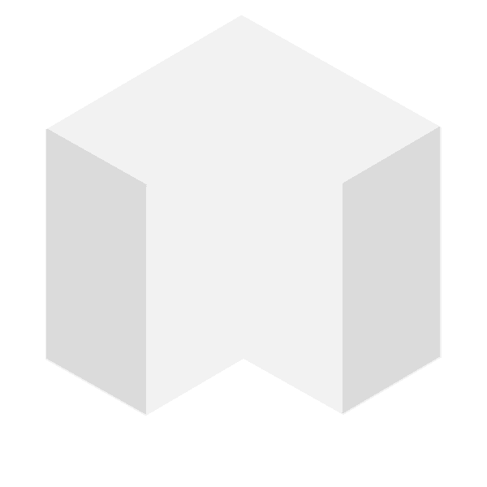
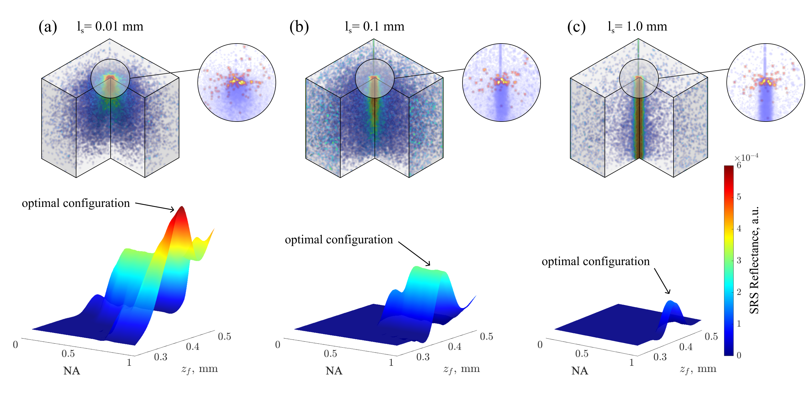
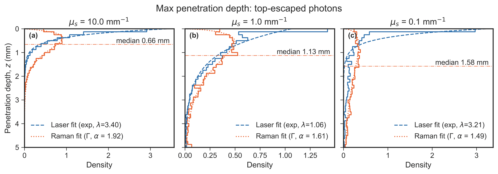
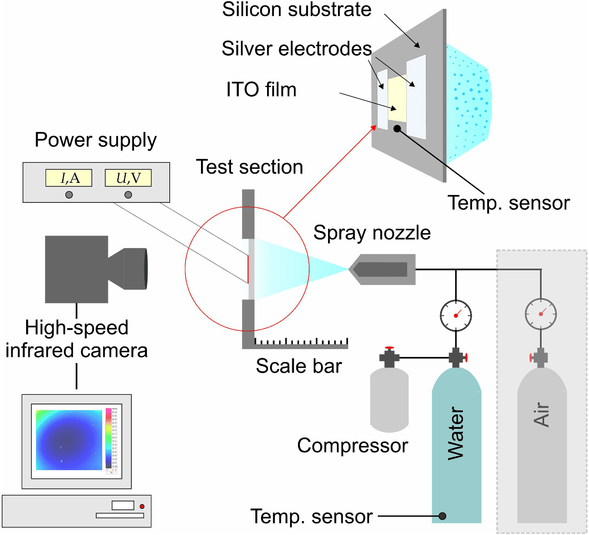
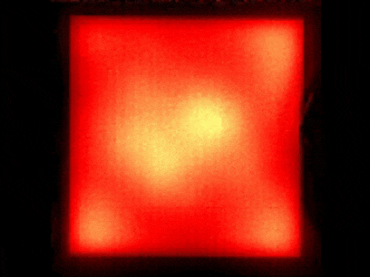
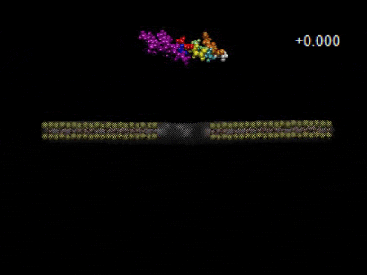
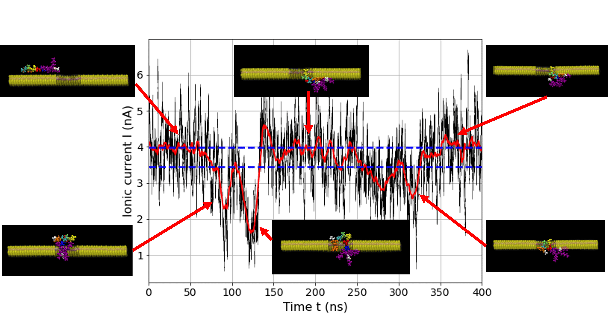

# Portfolio

I've always gravitated toward the overlap of **computation + physics + real-world application**. What excites me most is taking a difficult physical process, turning it into a model, validating it against reality, and then pushing it toward something useful — whether that is a simulation framework, an analysis pipeline, a sensing concept, or a working prototype.

This page is a concise walk through that path.

## Contents
- [Raman-NMC](#01--raman-nmc-nonlinear-monte-carlo-for-optical-sensing)
- [Laser boiling bubble tracking](#02--computer-vision-in-laser-induced-boiling-experiments)
- [Thermal R&D pipelines](#03--thermal-rd-active-cooling-and-ir-data-pipelines)
- [Neurolumber](#04--neurolumber-from-garage-prototype-to-industrial-cv-startup)
- [Nanopore sensing](#05--molecular-dynamics-for-nanopore-sensing)

---

# 01 — NMC: nonlinear Monte Carlo for optical sensing

**Focus:** computational physics | GPU simulation | Raman transport | optical diagnostics

## Starting point

I started my PhD with a fairly clear motivation: I wanted to contribute to modern preventive diagnostics through computation.

After my Master's, I became especially interested in optical methods. They felt like one of the most promising directions: information-rich, non-invasive in principle, and still very open to better modeling. The more I looked into emerging nonlinear techniques, the more I wanted to make existing computational models more realistic and actually useful for practical decision-making.

That led me to NMC — a Monte Carlo framework I have been advancing with a particular focus on Raman-related transport. My broader goal here is to support **in-silico optical digital twin studies** that help understand signal formation, optimise real-world setups, and eventually make raw optical measurements more interpretable.

## Work and action

My task was not simply to run an existing model, but to push it toward a more practical and expressive simulation tool. From an engineering point of view, this also meant learning GPU programming in a new ecosystem and making the workflow efficient enough to move from “interesting but heavy” to “actually usable”.

By now, I've developed the Raman-focused contribution to NMC by combining physics-driven modeling with GPU-oriented implementation.

The main things I worked on were:

- learning and applying **parallel GPU programming in Metal**
- using **Apple unified memory architecture** for large batched simulations
- implementing a **Raman kernel** for spontaneous and stimulated Raman scattering (see [snippet](./01-raman-nmc/snippet))
- enabling **path tracing of individual photons** for interpretation of signal origin
- studying how signal depends on medium properties and setup parameters
- preparing the framework for future extension toward **implicit geometry with signed distance functions (SDFs)**

## Result

The result is a practical nonlinear optical simulation workflow built on top of NMC, with my main contribution being the **Raman transport kernel and the surrounding Python-based analysis framework**.

  
  
  

  <em>Photon fluence render for different scattering coefficient.</em>

For me, the most important outcome is that this work moved the model closer to being a real design tool rather than just a numerical exercise. [It](https://github.com/IlyaVladyko/NMC/NMC-samples) can already be used to ask questions that matter for sensing and diagnostics:

- where does the detected Raman signal actually originate?
- what detection geometry is likely to be more effective before going into the lab?

  

  <em>Stimulated Raman photon visualisation and setup parameters analysis.</em>

- how deep do the informative backscattered photons probe?

  

  <em>Median penetration depth visualisation.</em>

The framework has also been:

- **benchmarked against another model**, reducing runtime from **days or hours to minutes** ([link](https://doi.org/10.22541/au.175766965.59561322/v1))
- **validated against experiment**, with the validation study forming part of an upcoming paper.

---

# 02 — Computer Vision in Laser-Induced Boiling Experiments

**Focus:** experiment automation | computer vision | physics validation

During my Master's studies (2018–2020), alongside modeling phase transitions in locally overheated liquids, I wanted to validate the theory experimentally and explore a practical physical system where similar dynamics occur.

A close analogue appeared in **endovenous laser ablation (ELVA)** - a medical procedure where laser radiation heats liquid near an optical fiber inside a vein. The liquid rapidly overheats, forms a vapor bubble, and the bubble dynamics contribute to the therapeutic effect.

To study this phenomenon, I conducted a series of **high-speed laser-induced boiling experiments** with a **semiconductor laser (λ = 1.94 µm)** with power up to **10 W** and a **high-speed camera capable of 100,000 fps**. The goal was to observe bubble formation and collapse dynamics and compare them with my theoretical model describing inertial and thermal processes during bubble evolution.

High-speed recordings quickly produced large volumes of data, so manual analysis was not practical.  
To address this, I built a **[Python-based computer vision pipeline](./02-computer-vision/snippet-contours)** that automatically tracked bubble evolution frame by frame.

The workflow extracted the **bubble contour**, computed its **equivalent radius**, and reconstructed the **radius–time curve** for comparison with the theoretical model.

  

The experiments provided:
- experimental validation of the theoretical bubble dynamics [model](https://doi.org/10.1038/s41598-020-73596-x)
- new insight into the operation mode of ELVA
- a reproducible experimental + computational workflow for analysing boiling

Beyond the physics itself, this project became my first serious step into computer vision for scientific data analysis. More importantly, the outcomes were noticed by colleagues working on phase-transition-based cooling systems, which led to my involvement in a later R&D project on thermal management technologies.

# 03 — Thermal R&D: Spray Cooling Data Pipelines

**Focus:** experimental R&D | thermal imaging | automated analysis

After working on laser-induced boiling experiments, I joined a research group investigating **phase-transition-based cooling systems** for high heat-load objects such as electronics in data centres.

The concept relied on **spray cooling**, where liquid droplets impact a heated surface and remove heat through forced convection, evaporation and boiling. To study the dynamics of this process, we performed experiments on a **transparent heater that emulated chip heat-load conditions**.

The experiments were recorded using a **high-speed thermal imaging camera** operating at **1.5 kHz**, with a resolution of **125 px/mm^2**. Over time this produced a very large dataset — **more than 1000 high-speed IR videos**.

Manually analysing this data was unrealistic, so I built a **Python-based analysis pipeline** to process the entire dataset automatically.

## Computer vision and analysis workflow

The pipeline performed several tasks directly on the video stream:

- accurately reading IR data file 
- automatically locating the **heated surface** on each frame
- extracting **radiation intensity data**
- converting intensity to **temperature** using calibration
- temporal averaging and statistics
- exporting results into structured tables for further analysis

By the end of the study the system could also **track dry spot formation and evolution**, identifying their contours, position, and temperature over time.

This allowed us to observe the evolution of the cooling regime:
> forced convection -> boiling -> dry spot formation

## Example outputs

  
  

Thermal imaging of spray cooling experiments, and experimental setup.

The analysis pipeline used **OpenCV**, **NumPy**, **SciPy**, **Pandas**, and a modified version of the **[PyRadi](https://github.com/NelisW/pyradi)** library for thermal observations using our type of camera.

[Here](./02-computer-vision/snippet-ir-data-processing) is a simplified example showing how the heated region was detected and analysed.

## Result
This workflow made it possible to process large volumes of thermal imaging data automatically and extract meaningful engineering insights.

The experiments helped us analyse:
- transitions between forced convection and boiling
- dry spot onset and evolution
- temperature distribution under different thermal loads and spray modes

For me personally, this project was an important step toward industrial-style R&D computing — building tools that convert raw experimental data into structured, interpretable results.

The work also formed part of the broader investigation into spray cooling systems described in the following publications [1](https://doi.org/10.1016/j.ijft.2023.100504), [2](https://doi.org/10.1016/j.icheatmasstransfer.2024.108145). 

# 04 — Neurolumber: Industrial Computer Vision Startup

**Focus:** industrial CV | prototyping | real-time decision systems

While working with computer vision in experimental research, I realised that the same approach could solve practical problems outside the lab. Together with a colleague, we identified a gap in the woodworking industry: existing machines could cut boards quickly, but identifying structural defects such as knots still relied heavily on manual inspection or expensive proprietary systems.

We decided to test whether a lightweight **computer vision scanner** could detect such defects and communicate directly with machine controllers. The project started as a simple garage prototype built from an Arduino-based controller, several cameras, custom software for image acquisition and analysis. After a sucsesfull presentation, we secured a partnerchip with a machine manufacturer.  

Our initial goal was modest: detect knots on a wooden board and send a signal to the machine controller quickly enough to be useful in production. While the business evolved, the device and its functions broadened.

## Computer vision system

The prototype evolved into a compact scanning system capable of:

- capturing board images while it moves on a conveyor
- identifying useful size, knots and other structural features
- sending commands to machine controllers
- operating within industrial timing constraints

The system combined computer vision, device prototyping, and real-time communication with manufacturing equipment.

  

Prototype scanner, knot detection, and early industrial deployment.

The key constraint was latency: the system had to analyse the board and communicate decisions quickly enough for the machine to react in real time.

## Result
What started as a garage prototype eventually turned into a real industrial [project](https://neurolumber.ru/#rec792552846).

We built and tested several working scanner prototypes, validated the concept on real production lines
secured $115k in investment, generated profit in the first year, expanded CV solutions to other industrial applications. 

For me personally, this project was an important shift from purely academic work to product-oriented engineering.

That experience later influenced how I approach technical work in general: build something that not only works in theory, but can survive the constraints of the real world.

# 05 — Nanopore Molecular Dynamics for Peptide Sensing

**Focus:** molecular dynamics | nanoscale sensing | dataset generation

Another project I had the opportunity to contribute to explored sensing at a completely different scale — **nanopore-based molecular detection**.

In this concept, a peptide moves through a nanoscale pore under an applied electric field. As it passes through the pore, it partially blocks ionic current. These changes in current can be measured and analysed to identify molecular structure, potentially enabling single-molecule sensing.

My role in the project focused on **molecular dynamics simulations** used to study this process and generate data for further analysis.

## Simulation approach

Using **GROMACS-based molecular dynamics simulations**, I modelled how the peptide interacts with the pore and how the ionic environment evolves as the molecule translocates.

The simulations allowed us to observe how different amino acids affect the **ionic current signature** as the peptide moves through the pore.

  
  

  

Peptide translocation through nanopore and a resulting ionic current profile.

## Result
The simulations produced datasets describing how ionic current varies as peptides move through the nanopore, providing insight into how different molecular structures influence the measured signal.

For me, this project was particularly interesting because it extended my work into nanoscale physics and molecular simulation, while still touching on a theme that appears throughout many of my projects: sensing.

Whether the system involves photons, bubbles, thermal fields, or molecules, the core idea is similar — understanding how physical processes generate measurable signals and how those signals can be interpreted.